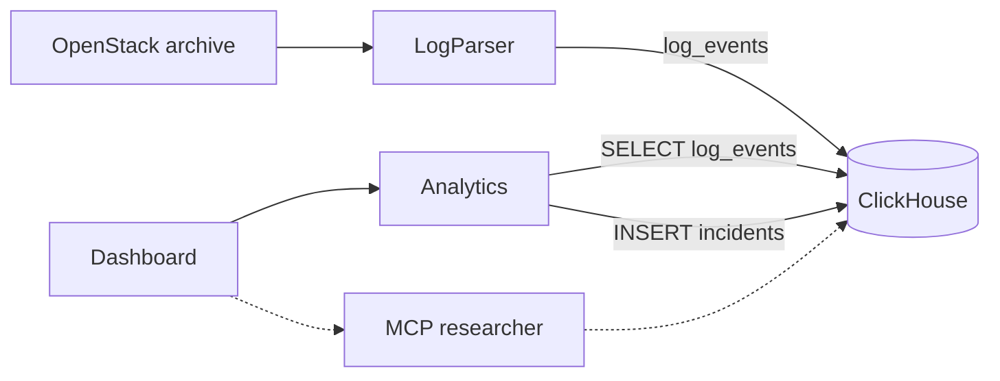

# Logregartor

Hackathon project for log analysis: anomaly detection, event correlation, and explanations of likely failure causes based on the records found.

Data: [OpenStack from Loghub](https://github.com/logpai/loghub/tree/master/OpenStack). Brief: [AI-Powered Observability](docs/AI_Powered_Observability_Hackathon_1.pdf).

The target flow—the path for the judging panel—is: logs → incidents → incident card and source lines.
Snapshot contract: [Analytics v1](docs/ANALYTICS_PLAN.md).
UI workflow and launch instructions: [Dashboard integration](docs/DASHBOARD_INTEGRATION.md).



Analytics, rather than ClickHouse, performs reads and writes. `run` fetches published
events and stores `incidents`; `serve` only reads the snapshot. The Dashboard arrow
denotes a module call. The dashed line is the researcher's read-only path.

Components:

- **LogParser** — OpenStack parsing, templates, and repeatable event loading.
- **ClickHouse** — `log_events` and published incidents.
- **Analytics** — batch detection and a read-only API over a run snapshot.
- **Dashboard** — investigation: signal → stages → source line.
- **MCP** — researcher read-only access to ClickHouse.

Vector search and RAG explanations are outside this architecture. Services are started
from [docker-compose.yml](docker-compose.yml).

Minimum goal: a reproducible OpenStack demo—load logs, derive templates, detect one class of anomalies, and show an event timeline, likely causes with links to logs, and a recommended next step.

Local ClickHouse (Docker Compose required):

```bash
docker compose up -d --wait clickhouse
```

HTTP: `http://localhost:8123`, native: `localhost:9000`. Database: `logs`; user: `logregartor`; local-development password: `localdev`. Other services on this Compose network connect to `clickhouse:8123` or `clickhouse:9000`.

The image version, database, credentials, and ports can be overridden through the `CLICKHOUSE_*` environment variables listed in [docker-compose.yml](docker-compose.yml). Data is stored in the `clickhouse_data` volume and remains after `docker compose down`.

The official `mcp-clickhouse` version `0.6.0` has been added for the AI researcher.
After configuring the two secrets in your local `.env`, run:

```bash
docker compose --profile mcp up -d --build --wait mcp-clickhouse
docker compose exec -T mcp-clickhouse python /app/smoke.py
```

MCP endpoint: `http://127.0.0.1:8000/mcp`; transport: Streamable HTTP;
authentication: `Authorization: Bearer <CLICKHOUSE_MCP_AUTH_TOKEN>`.
The server uses a dedicated read-only ClickHouse user.
Setup, researcher connection, and query examples: [MCP ClickHouse](docs/MCP_CLICKHOUSE.md).

`clickhouse-init` creates the schemas and nine views for metrics, charts, templates, and incidents.
For an existing database: `docker compose run --rm clickhouse-init`.
UI coverage and metric semantics: [ClickHouse aggregates](docs/UI_AGGREGATES.md).

The UI can be launched separately, without the database or MCP:

```bash
docker compose up -d --build --wait ui
```

It will be available at `http://localhost:3000`. Without Analytics, it shows a data-unavailable state. To view incidents, also start `analytics` and `clickhouse`, import logs, and run `log_analytics run`: [step-by-step integration](docs/DASHBOARD_INTEGRATION.md). Viewing incident cards and source lines does not require OpenAI. For chat, set `OPENAI_API_KEY`; for additional research through MCP, set `CLICKHOUSE_MCP_PASSWORD` and `CLICKHOUSE_MCP_AUTH_TOKEN` in the local `.env`. The server-side OpenAI Agents SDK connects directly to `mcp-clickhouse` via `MCP_SERVER_URL`; MCP keys and results are not sent directly to the browser.

Start all services with a single command:

```bash
docker compose --profile mcp up -d --build --wait
```
