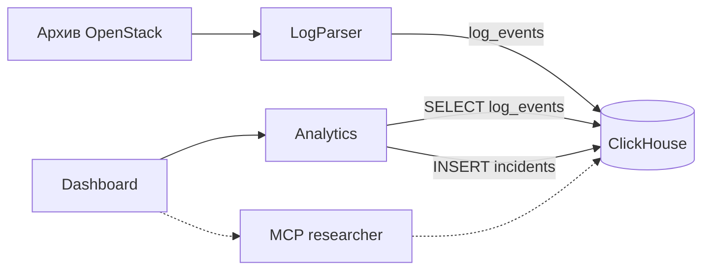

# Logregartor

Хакатонный проект для анализа логов: поиск аномалий, связывание событий и объяснение вероятных причин сбоев на основе найденных записей.

Данные: [OpenStack из Loghub](https://github.com/logpai/loghub/tree/master/OpenStack). Задание: [AI-Powered Observability](docs/AI_Powered_Observability_Hackathon_1.pdf).

Целевая схема — путь жюри: логи → инциденты → карточка и исходные строки.
Контракт среза: [Analytics v1](docs/ANALYTICS_PLAN.md).
Рабочий путь UI и запуск: [интеграция Dashboard](docs/DASHBOARD_INTEGRATION.md).



Пишет и читает Analytics, не ClickHouse. `run` забирает опубликованные события
и кладёт `incidents`; `serve` только читает снимок. Стрелка Dashboard — вызов
модуля. Пунктир — read-only контур researcher.

Компоненты:

- **LogParser** — разбор OpenStack, шаблоны, повторяемая загрузка событий.
- **ClickHouse** — `log_events` и опубликованные инциденты.
- **Analytics** — пакетный Detect и read-only API над снимком запуска.
- **Dashboard** — расследование: сигнал → этапы → исходная строка.
- **MCP** — read-only доступ researcher к ClickHouse.

Векторный поиск и RAG-объяснение в эту схему не входят. Сервисы поднимаются
из [docker-compose.yml](docker-compose.yml).

Минимальная цель: воспроизводимое демо на OpenStack — загрузить логи, выделить шаблоны, обнаружить один класс аномалий и показать хронологию событий, вероятные причины со ссылками на логи и рекомендуемый следующий шаг.

Локальный ClickHouse (нужен Docker Compose):

```bash
docker compose up -d --wait clickhouse
```

HTTP: `http://localhost:8123`, native: `localhost:9000`. База: `logs`, пользователь: `logregartor`, пароль для локальной разработки: `localdev`. Другие сервисы в этой Compose-сети подключаются к `clickhouse:8123` или `clickhouse:9000`.

Версию образа, базу, учётные данные и порты можно переопределить переменными окружения `CLICKHOUSE_*`, указанными в [docker-compose.yml](docker-compose.yml). Данные хранятся в volume `clickhouse_data` и сохраняются после `docker compose down`.

Для AI researcher добавлен официальный `mcp-clickhouse` версии `0.6.0`.
После настройки двух секретов в локальном `.env` запустите:

```bash
docker compose --profile mcp up -d --build --wait mcp-clickhouse
docker compose exec -T mcp-clickhouse python /app/smoke.py
```

MCP endpoint: `http://127.0.0.1:8000/mcp`, транспорт Streamable HTTP,
авторизация `Authorization: Bearer <CLICKHOUSE_MCP_AUTH_TOKEN>`.
Сервер использует отдельного пользователя ClickHouse только для чтения.
Настройка, подключение researcher и примеры запросов: [MCP ClickHouse](docs/MCP_CLICKHOUSE.md).

Схемы и девять представлений для метрик, графиков, шаблонов и инцидентов создаёт
`clickhouse-init`. Для существующей базы: `docker compose run --rm clickhouse-init`.
Покрытие UI и семантика показателей: [агрегаты ClickHouse](docs/UI_AGGREGATES.md).

UI можно запустить отдельно, без базы и MCP:

```bash
docker compose up -d --build --wait ui
```

Он будет доступен на `http://localhost:3000`. Без Analytics показывается состояние недоступности данных. Для просмотра инцидентов запустите также `analytics` и `clickhouse`, импортируйте логи и выполните `log_analytics run`: [пошаговая интеграция](docs/DASHBOARD_INTEGRATION.md). Просмотр карточек и исходных строк не требует OpenAI. Для чата задайте `OPENAI_API_KEY`; для дополнительного исследования через MCP — `CLICKHOUSE_MCP_PASSWORD` и `CLICKHOUSE_MCP_AUTH_TOKEN` в локальном `.env`. Серверный OpenAI Agents SDK подключается напрямую к `mcp-clickhouse` по `MCP_SERVER_URL`; ключи и результаты MCP не передаются браузеру напрямую.

Все сервисы запускаются одной командой:

```bash
docker compose --profile mcp up -d --build --wait
```
