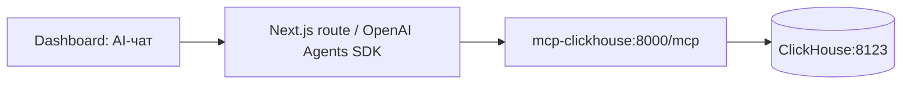

# MCP ClickHouse для researcher

В Compose подключён официальный [ClickHouse/mcp-clickhouse](https://github.com/ClickHouse/mcp-clickhouse)
из PyPI, версия `0.6.0`. MCP предоставляет инструменты доступа к данным;
LLM, историю чата и цикл вызова инструментов реализует серверный модуль UI через OpenAI Agents SDK.



## Запуск

1. Добавьте в игнорируемый Git файл `.env` две переменные из [.env.example](../.env.example):
   `CLICKHOUSE_MCP_PASSWORD` — пароль пользователя БД `logregartor_mcp`,
   `CLICKHOUSE_MCP_AUTH_TOKEN` — токен доступа к MCP.
   Для каждого значения отдельно выполните `openssl rand -hex 32`.
   Существующие настройки ClickHouse в `.env` сохраняйте.
2. Запустите сервис и проверку из корня репозитория:

```bash
docker compose --profile mcp config --quiet
docker compose --profile mcp up -d --build --wait mcp-clickhouse
docker compose exec -T mcp-clickhouse python /app/smoke.py
```

Профиль `mcp` включает сам сервер и однократный сервис `mcp-clickhouse-init`.
Инициализация создаёт или обновляет выделенного пользователя и выдаёт ему
`SELECT` на `${CLICKHOUSE_DB:-logs}.*`. Она работает и с существующим volume:
очищать базу или повторно импортировать данные не требуется. Таблицы создаёт
конвейер LogParser; MCP может успешно подключиться и к пустой базе.
Имя базы должно соответствовать `[A-Za-z_][A-Za-z0-9_]*`, как и в LogParser.

При изменении пароля или токена повторите команду запуска. Для остановки только MCP:

```bash
docker compose --profile mcp stop mcp-clickhouse
```

## Подключение клиента

| Откуда подключается клиент | URL |
| --- | --- |
| С машины разработчика | `http://127.0.0.1:8000/mcp` |
| Из контейнера в той же Compose-сети | `http://mcp-clickhouse:8000/mcp` |

Транспорт: **Streamable HTTP**. В запросах нужен заголовок
`Authorization: Bearer <значение CLICKHOUSE_MCP_AUTH_TOKEN>`.
Next.js хранит токен у себя; браузер обращается только к `/api/chat`.
Порт на машине можно изменить через `CLICKHOUSE_MCP_PORT` в `.env`.

Пример вызова из Python-клиента FastMCP, уже установленного в контейнере MCP:

```python
import asyncio
import os

from fastmcp import Client


async def main():
    async with Client(
        "http://mcp-clickhouse:8000/mcp",
        auth=os.environ["CLICKHOUSE_MCP_AUTH_TOKEN"],
    ) as client:
        tools = await client.list_tools()
        result = await client.call_tool("run_query", {
            "query": "SELECT 1 AS ok"
        })
        print(result)


asyncio.run(main())
```

## Доступные инструменты

Набор соответствует версии `0.6.0`; клиент получает актуальные схемы через MCP discovery.

| Инструмент | Параметры / назначение |
| --- | --- |
| `list_databases` | Доступные пользователю базы |
| `list_tables` | `database`, опционально `like`, `page_size`, `page_token`; таблицы и колонки |
| `run_query` | `query`; SQL для агрегатов, фильтрации и исходных событий |

chDB отключён. Доступ к БД ограничен правами пользователя `logregartor_mcp`
и `readonly=1`. Лимиты пользователя: 30 секунд на запрос, 10 000 строк результата,
1 GB памяти. Превышение лимита результата возвращает ошибку, а не молчаливо
обрезанную статистику. MCP допускает до четырёх одновременных query workers.

`/health` проверяет соединение с ClickHouse и доступен без токена.
Проверка `smoke.py` отдельно проверяет авторизацию `/mcp`, список инструментов,
метаданные БД, `SELECT` и невозможность отключить `readonly`.

## Запросы для OpenStack

После загрузки данных используйте опубликованные представления `log_events`
и `event_templates`. В `log_events_raw` могут находиться незавершённые попытки
импорта; их нельзя включать в исследовательские сводки.

Сначала определить временные границы и доступные наборы:

```sql
SELECT dataset_id, min(event_time) AS first_event,
       max(event_time) AS last_event, count() AS events
FROM log_events
GROUP BY dataset_id
```

Пример минутных агрегатов (даты и dataset заменить результатами discovery):

```sql
SELECT toStartOfMinute(event_time) AS minute, component, level,
       count() AS events
FROM log_events
WHERE dataset_id = 'openstack'
  AND event_time >= toDateTime('2017-05-14 00:00:00', 'UTC')
  AND event_time < toDateTime('2017-05-15 00:00:00', 'UTC')
GROUP BY minute, component, level
ORDER BY minute, component, level
LIMIT 1000
```

Для доказательств запросить `event_id`, `event_time`, `message`, `raw_text`
по выбранным `dataset_id`, `source_sha256`, `instance_id` и временному интервалу.
Исторический архив исследовать по времени событий; `now() - INTERVAL 1 HOUR`
не соответствует периоду набора. Baseline и группировки VM должны учитывать
источник: одинаковые идентификаторы из разных файлов не объединять автоматически.

Агрегаты в этой интеграции вычисляются SQL-запросами. Отдельные materialized views,
VM timeline, сравнение с baseline и семантический поиск пока не добавлены.
Researcher должен сохранять запрос, фильтры и идентификаторы доказательств для
проверки выводов; названия normal/abnormal и оценочные метки не передавать LLM.

## Диагностика

- `401` на `/mcp`: проверить токен у backend и сервера.
- `421`: hostname клиента должен входить в `CLICKHOUSE_MCP_ALLOWED_HOSTS`.
- `403` при запросе из браузера: подключать MCP через backend; Origin по умолчанию закрыт.
- Ошибка init-сервиса: проверить `CLICKHOUSE_MCP_PASSWORD` и учётные данные администратора БД.
- Пустой `list_tables`: загрузить данные через [LogParser](../src/LogParser/README.md).

Настройки upstream: [README mcp-clickhouse](https://github.com/ClickHouse/mcp-clickhouse#configuration).
