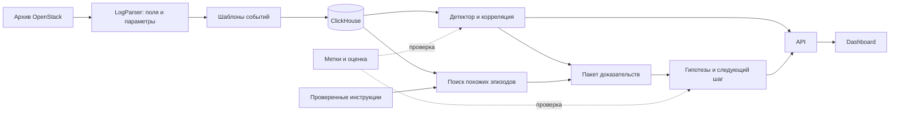

# Исследование: OpenStack-логи и решение для AI-Powered Observability

Дата проверки источников и данных: **12 сентября 2026 года**.

**Рекомендация:** построить расследование медленного создания виртуальной машины: обнаружить отклонение, восстановить этапы запуска, показать исходные доказательства, сформулировать проверяемые гипотезы и следующий шаг. Для этого достаточно Go-парсера, ClickHouse, небольшого Python-бэкенда и отдельного дашборда. Семантический поиск добавлять поверх уже связанных событий.

При исследовании проверены задание, публичные репозитории, статьи и сам полный архив OpenStack. Найден рабочий сигнал: четыре VM из `anomaly_labels.txt` занимают первые четыре места по длительности создания. Это результат локального разведочного анализа; промышленная точность и качество определения первопричины ещё не измерены.

## 1. Что требует хакатон

В [задании](AI_Powered_Observability_Hackathon_1.pdf) определены обязательные результаты: один Loghub-набор, шаблоны событий, один класс аномалий, хронология доказательств и ранжированные гипотезы. Критерии пользы — время до первой обоснованной гипотезы, precision@k, качество ссылок на доказательства и сокращение дублирующихся сигналов. См. страницы PDF 7, 13–14; напечатанные номера слайдов 8, 15–16.

Предлагаемая история: **«VM создалась успешно, но существенно медленнее нормы. Система заметила задержку даже без ERROR, локализовала её на этапе запуска и показала, что проверить дальше».**

Это соответствует данным лучше, чем история про полностью упавший сервис. В предоставленном задании нет весов оценивания или правил, позволяющих гарантировать победу. Далее — стратегия усиления заявки на основе заявленных критериев.

## 2. Что действительно находится в данных

### Полный архив и образец 2k решают разные задачи

[Loghub](https://github.com/logpai/loghub) указывает для OpenStack 207 820 строк и 58,61 MiB исходных данных. [Описание OpenStack](https://github.com/logpai/loghub/blob/master/OpenStack/README.md) связывает набор с экспериментами на CloudLab и внедрением отказов. Полный архив скачан из [Zenodo](https://zenodo.org/records/3227177/files/OpenStack.tar.gz); содержимое проверено локально.

| Файл в архиве | Строк | VM с явным `[instance: UUID]` | Завершённых созданий VM | Медиана / максимум создания, с |
| --- | ---: | ---: | ---: | ---: |
| `openstack_normal1.log` | 52 312 | 557 | 556 | 20,545 / 22,91 |
| `openstack_normal2.log` | 137 074 | 1 315 | 1 313 | 20,54 / 23,34 |
| `openstack_abnormal.log` | 18 434 | 198 | 197 | 20,62 / 51,59 |

Таблица — собственный подсчёт, методика и результаты находятся в [аудите JSON](research/openstack_audit.json). VM подсчитывались отдельно внутри каждого файла; длительность извлекалась из сообщения о завершении создания. Это не количество всех возможных сущностей, упомянутых в URL и других полях.

В `anomaly_labels.txt` перечислены **четыре UUID**, относящиеся к `openstack_abnormal.log`. Имя файла не означает, что все его 198 VM аномальны. Разметка указывает внедрённые аномалии, но не даёт отдельного диагноза для каждого UUID.

[Структурированный образец 2k](https://github.com/logpai/loghub/blob/master/OpenStack/OpenStack_2k.log_structured.csv) содержит 2 000 строк, 43 `EventId`, 1 969 `INFO` и 31 `WARNING`. Колонки с меткой аномалии нет. Его следует использовать для проверки парсинга и шаблонов; качество детектора проверять на полном архиве и метках VM. `EventId` — класс сообщения, а не идентификатор конкретной строки и не метка сбоя.

### Ловушки, которые повлияют на реализацию

- В аномальном файле **нет ERROR/CRITICAL**, а в двух нормальных файлах такие строки есть. Уровень логирования нельзя приравнивать к целевой аномалии.
- Во всём архиве 184 строки без блока request context. Среди них traceback и восемь строк с пустым сообщением. Парсер с обязательным `[...]` потеряет данные; пропуски нужно учитывать явно.
- HTTP 404 встречается и в нормальных сценариях. Его значение зависит от операции и этапа жизненного цикла.
- Явный `[instance: UUID]` есть в 51 553 строках — примерно 24,8% всего архива. Остальные записи сохранять и связывать дополнительно по request ID, URL и времени.
- Временные метки не содержат часовой пояс. Сохранять исходное значение и явное предположение о зоне. Префикс `nova-compute.log...` — имя источника, не надёжный hostname.
- Маскирование всех чисел уничтожит полезный сигнал, если предварительно не извлечь длительность, HTTP-статус и ресурсные параметры в отдельные поля.

### Почему литературные результаты нельзя переносить автоматически

В оригинальной [статье DeepLog, CCS 2017](https://nlp.cs.utah.edu/assets/pdfs/du2017deeplog.pdf) описано 1 335 318 OpenStack-записей и три типа внедрённых сбоев: таймаут Neutron и ошибки libvirt при уничтожении/очистке VM. Это другой объём, чем доступный архив Loghub.

[Landauer и соавторы, FSE 2024](https://www.skopik.at/ait/2024_fse.pdf), раздел 3.4, сообщают о 98,5% перекрытии нормальных и аномальных последовательностей в изученном представлении OpenStack и проблемах их различимости. Их анализ рассматривает 198 аномальных последовательностей; в проверенном нами архиве перечислены четыре аномальные VM. Единицы анализа и правила разметки необходимо согласовать до сравнения метрик.

Наш результат относится к **числовому параметру длительности и четырём явным меткам**. Он не опровергает выводы о слабой различимости последовательностей шаблонов. Вывод для проекта: сохранять параметры и документировать разметку, версию данных и единицу оценки.

## 3. Что уже делали на GitHub и что взять

В таблице разделены проекты с прямыми OpenStack-примерами и инструменты общего назначения. Библиотеки и чужие модели в рамках исследования не запускались; изучены документация и указанный код.

| Проект | Как используют данные | Что применить здесь | Ограничение |
| --- | --- | --- | --- |
| [LOGPAI/logparser](https://github.com/logpai/logparser) | Проверяют выделение шаблонов на Loghub, включая OpenStack 2k | Формат записи, эталонные шаблоны, оценку группировки | Качество парсинга не равно качеству поиска аномалий |
| [LOGPAI/Drain3](https://github.com/logpai/Drain3) | Потоково объединяют сообщения в шаблоны; поддерживают маски, сохранение состояния и режим сопоставления с готовыми шаблонами | Готовый движок шаблонов и замороженный словарь для оценки | Передавать тело сообщения после извлечения заголовка и числовых признаков |
| [aaron-y-chen/deeplog](https://github.com/aaron-y-chen/deeplog/blob/master/example/preprocess.py) | OpenStack → Spell → EventId → минутные последовательности; словарь из normal1, неизвестные события обозначают `-1` | Понятную базовую цепочку подготовки данных | Сторонняя PyTorch-реализация; общий минутный интервал смешивает VM и не сохраняет все параметры |
| [LOGPAI/loglizer](https://github.com/logpai/loglizer) | Последовательности и окна превращают в векторы числа событий; применяют PCA, Isolation Forest и другие методы | Быстрые сравнения с простыми моделями | Опубликованная таблица результатов относится к HDFS; OpenStack требует собственного загрузчика и проверки |
| [AIT: anomaly-detection-log-datasets](https://github.com/ait-aecid/anomaly-detection-log-datasets) | Исследуют пригодность наборов и предоставляют подготовленные последовательности, в том числе OpenStack | Проверку дублей, представления данных и предпосылок эксперимента | Готовые train/test-файлы нельзя брать без сверки с исходными метками |
| [ParisaKalaki/openstack-logs](https://github.com/ParisaKalaki/openstack-logs) | Публикуют Nova-логи DevStack: нормальное создание и сценарии DHCP-off, undefine и быстрого уничтожения VM | Резервный набор для отдельного эксперимента с явно названным сценарием | Другой эксперимент; не смешивать его метрики с Loghub. Проверена документация, полный аудит не выполнен |
| [BU EC528: Incident Analysis](https://github.com/BU-EC528-Spring-2026/Agentic-Multi-Source-Log-Correlation-for-Incident-Analysis) | Объединяют структурированные Loghub CSV, правила, корреляцию и LLM-отчёт | Контракт события, ссылки на доказательства, альтернативные гипотезы и условия их проверки | Учебный прототип, а не доказанный результат для нашего архива |
| [EvoTestOps/LogLead](https://github.com/EvoTestOps/LogLead) | Разделяют загрузчики, обогащение признаками и детекторы; сравнивают представления логов | Архитектурное разделение и оценку простых признаков | Не считать его готовым OpenStack-бенчмарком без проверки загрузчика |

В [Drain benchmark](https://github.com/logpai/logparser/blob/main/logparser/Drain/benchmark.py) для OpenStack заданы `depth=5`, `st=0.5`. Это начальная точка эксперимента, не универсальные настройки. В [README Drain](https://github.com/logpai/logparser/blob/main/logparser/Drain/README.md) указаны разные метрики: F1 группировки 0,992536 и accuracy 0,7325. Называть это «точностью 99%» некорректно.

У BU дополнительно изучены [правила VM](https://github.com/BU-EC528-Spring-2026/Agentic-Multi-Source-Log-Correlation-for-Incident-Analysis/blob/main/src/agents/openstack_vm_agent.py) и [корреляция](https://github.com/BU-EC528-Spring-2026/Agentic-Multi-Source-Log-Correlation-for-Incident-Analysis/blob/main/src/agents/correlation/correlation_agent.py): используются lifecycle-паттерны, группировка по VM и временная близость. Для нашего стенда регулярные start/stop могут быть штатным тестовым сценарием. Также нельзя выводить причинную связь между независимыми наборами Linux, Apache и OpenStack только из похожего времени.

## 4. Проверенный сценарий и предварительные метрики

### Детектор медленного создания VM

Первый детектор извлекает `build_duration_seconds` из сообщения завершения создания. Для каждой VM внутри файла берётся максимальная найденная длительность. Базовое распределение строится на `normal1`; сравнение — на `normal2 + abnormal`, где есть 1 510 завершённых созданий VM. Ещё три VM в этих двух файлах не имеют такого маркера и исключены из этой оценки.

| Правило `duration > threshold` | TP | FP* | FN | Precision* | Recall по четырём меткам |
| --- | ---: | ---: | ---: | ---: | ---: |
| 22,91 с — максимум normal1 | 4 | 3 | 0 | 57,1% | 100% |
| 27,91 с — максимум normal1 + 5 с | 4 | 0 | 0 | 100% | 100% |
| 35 с — проверка чувствительности | 2 | 0 | 2 | 100% | 50% |

\* Неотмеченные завершённые создания условно считаются отрицательными примерами. Все результаты — из [локального аудита](research/openstack_audit.json).

**Это разведочный результат на четырёх положительных примерах.** Запас 5 секунд и порог 35 секунд исследованы после знакомства с данными; независимой проверки нет. Более того, normal1 записан 16 мая, а abnormal — 14 мая 2017 года: это ретроспективное сравнение, не проверка на будущем потоке. На защите обязательно показывать эти ограничения вместе с числами.

Если ранжировать завершённые создания по длительности, `precision@4 = 4/4`:

| VM | Длительность, с | Строка в `openstack_abnormal.log` |
| --- | ---: | ---: |
| `a445709b-6ad0-40ec-8860-bec60b6ca0c2` | 51,59 | 16731 |
| `544fd51c-4edc-4780-baae-ba1d80a0acfc` | 42,81 | 11983 |
| `1643649d-2f42-4303-bfcd-7798baec19f9` | 32,12 | 17237 |
| `ae651dff-c7ad-43d6-ac96-bbcd820ccca8` | 30,32 | 12089 |

### Что можно объяснить на реальном примере

Для первой VM проверена следующая хронология 14 мая; время приведено как в файле, без утверждения о часовом поясе:

| Время | Наблюдение | Строка |
| --- | --- | ---: |
| 21:42:42.360 | Ресурсы выделены успешно | 16640 |
| 21:42:43.044 | Началась подготовка образа | 16642 |
| 21:43:27.498 | Зафиксирован запуск VM | 16710 |
| 21:43:33.761 | Создание экземпляра завершилось успешно | 16727 |
| 21:43:33.762 | Запуск на гипервизоре занял 50,72 с | 16728 |
| 21:43:33.901 | Полное создание заняло 51,59 с | 16731 |

Обоснованный вывод: почти вся измеренная длительность приходится на запуск экземпляра на гипервизоре. Возможные направления проверки — сеть/VIF, работа libvirt и подготовка образа. Эти записи **не устанавливают однозначно**, какой компонент задержал операцию. Успешный claim ослабляет гипотезу отказа выделения ресурсов, но не исключает последующую конкуренцию за них.

В [документации Nova](https://docs.openstack.org/nova/14.0.5/sample_config.html) описано ожидание уведомления Neutron о подключении VIF. Это основание для диагностического вопроса, а не доказательство сетевого таймаута в конкретной VM. Следующий шаг: запросить совпадающие по request/instance ID логи Neutron и libvirt за этот интервал. Название внедрённого сбоя из статьи не должно автоматически становиться ответом модели.

## 5. Архитектура и модули

Ниже — предлагаемая реализация. В текущем репозитории есть Go-заготовка, Compose для ClickHouse и документация; перечисленные сервисы ещё предстоит построить. `src/LogParser/` принят как основной путь согласно `AGENTS.md`; перед реализацией проверить дублирующий каталог `LogParser/`.



Логические модули не требуют отдельных микросервисов. Для MVP достаточно задания импорта, одного API с аналитическими задачами, дашборда и ClickHouse. Метки находятся в контуре оценки и не поступают в признаки, поиск или LLM.

### 5.1. LogParser: структурирование и шаблоны

**Вход:** исходные файлы. **Выход:** JSONL нормализованных событий, каталог шаблонов и отчёт о разборе.

Оставить Go для чтения и структурирования. Извлекать время, уровень, компонент, request/instance ID, HTTP-метод и статус, длительности `build/spawn/destroy`. Заголовок, необязательный context и тело разбирать отдельно. Ошибочные записи сохранять с `parse_status`, исходным текстом и номером строки.

Начальный движок шаблонов — Drain3 через пакетный Python-адаптер: Go выдаёт JSONL, адаптер добавляет шаблоны и загружает результат. Это один логический конвейер с двумя этапами. Для полностью Go-варианта существует [Jaeyo/go-drain3](https://github.com/Jaeyo/go-drain3), но его эквивалентность и сохранение состояния здесь не проверялись; менять движок только после сравнения на 2k и реальных длительностях.

Перед маскированием сохранить числовые признаки. Маски UUID/IP использовать для шаблонов, а исходные связи — в структурированных полях. Шаблонизатор обучать только на выбранной reference-части; на оценке замораживать словарь. Неизвестный шаблон должен остаться видимым. Версионировать конфигурацию масок и словарь: изменение шаблона не должно незаметно переопределять прошлые события.

**Готовность:** все 207 820 физических строк учтены как события или явно зарегистрированные отклонения; четыре длительности извлекаются точно; повторный импорт сохраняет идентификаторы; traceback и пустое тело не теряются. Точность шаблонов проверена отдельно от полноты чтения.

### 5.2. Storage: ClickHouse

**Вход:** нормализованные события. **Выход:** фильтрация, хронология, агрегаты и эпизоды.

Предложение таблиц: `log_events`, `event_templates`, `incidents`, `incident_evidence`, `ingestion_runs`; метки хранить отдельно для оценщика. Для событий использовать MergeTree с порядком по `(dataset_id, component, event_time, event_id)`; окончательную схему проверить на запросах по VM. Загружать пакетами через [JSONEachRow](https://clickhouse.com/docs/reference/formats/JSON/JSONEachRow).

`event_id` вычислять из хеша источника и номера исходной строки; не путать с идентификатором шаблона. Такой ID сам по себе не обеспечивает дедупликацию в MergeTree: импорт должен проверять manifest завершённых файлов и корректно обрабатывать повтор после сбоя. Браузер обращается через API; SQL параметризован, выдача ограничена и постранична.

**Готовность:** повторная загрузка не удваивает данные, каждый evidence ID открывает точную исходную строку, счётчики согласованы с импортом.

### 5.3. Analytics: обнаружение и корреляция

**Вход:** события, параметры и reference-статистика. **Выход:** инциденты, причины срабатывания и связанная хронология.

P0 — детектор длительности с прозрачным порогом, ранжирование по отклонению и объединение сигналов одной VM в одну карточку. Сначала использовать `(dataset/run, instance_id)`, затем request ID и временной интервал. Время без общих идентификаторов даёт слабую связь. События без VM нельзя складывать в одну фиктивную сущность `unknown`.

Сохранять отдельно `anomaly_score`, причину правила, источник baseline и полноту наблюдений. P1 — длительности этапов, редкость шаблонов и частоты повторений. Isolation Forest оправдан только как дополнительное сравнение на этих признаках; обучение DeepLog/LogBERT не входит в критический путь.

Пилот обнаруживает задержку после сообщения о завершении. Для раннего предупреждения нужен отдельный детектор незавершённого создания с таймером по времени события; его качество и задержку измерять отдельно. Конец файла и отсутствующий старт означают неполное наблюдение, а не автоматически сбой.

### 5.4. Knowledge: поиск и объяснение

**Вход:** инцидент, связанные события, проверенные инструкции. **Выход:** гипотезы с доказательствами, возражениями и следующей диагностической проверкой.

Строить документы поиска из эпизода одной VM: этапы, длительности, отклонения, несколько репрезентативных строк и их ID. Начальная граница — одна операция, при необходимости её временной фрагмент. Размер, например 500–1 000 токенов, — параметр эксперимента, а не требование. Соседство по числу строк не заменяет связь событий.

Порядок поиска: точные фильтры по сущности/запуску → поиск по сообщениям и шаблонам → семантические кандидаты → объединение рангов → расширение связанными событиями. Для малой коллекции эпизодов начать с векторов в ClickHouse и [cosineDistance](https://clickhouse.com/docs/reference/functions/regular-functions/distance-functions#cosineDistance), измерив задержку. Если нужен самостоятельный индекс, [Qdrant](https://qdrant.tech/documentation/search/hybrid-queries/) поддерживает сочетание dense/sparse-поиска и RRF. Отдельная БД не является необходимым условием первого демо.

LLM получает ограниченный пакет доказательств и возвращает структурированный ответ. Для каждой гипотезы обязательны `evidence_ids`, `counterevidence_ids`, `missing_evidence`, `next_check` и качественная степень уверенности. При отсутствии основания — «данных недостаточно». Число похожести вектора и anomaly score нельзя показывать как вероятность истинности причины.

Из контекста модели исключать `anomaly_labels.txt`, названия файлов с подсказкой normal/abnormal и ответы оценочного набора. Логи считать данными: вложенные в них инструкции не исполняются. Проверять существование ссылок автоматически, а соответствие утверждений доказательствам — отдельно. Диагностические рекомендации из runbook помечать как внешние знания. Реальных историй исправлений в этом архиве нет: «похожий эпизод» не означает «подтверждённое решение».

### 5.5. API: общий контракт модулей

Предлагается Python/FastAPI, поскольку он позволит держать аналитику и объяснение в одном приложении; [OpenAPI и схема моделей](https://fastapi.tiangolo.com/features/) помогают согласовать фронтенд. Это предложение стека, а не уже установленная зависимость.

| Предлагаемый endpoint | Назначение |
| --- | --- |
| `GET /incidents` | Ранжированные карточки с фильтрами |
| `GET /incidents/{id}` | Статистика, причина срабатывания, гипотезы |
| `GET /incidents/{id}/timeline` | Связанные события с происхождением связи |
| `GET /events/{id}` | Точная исходная запись |
| `POST /incidents/{id}/explanation` | Создание или получение сохранённого объяснения |
| `POST /search` | Поиск в пределах заданного набора и контекста |
| `GET /evaluation/latest` | Отдельный отчёт о проверке |

Минимальный `LogEvent`: `schema_version`, `event_id`, `dataset_id`, `ingestion_run_id`, `source_sha256`, `line_start/end`, `timestamp_raw`, `event_time`, `timezone_assumption`, `level`, `component`, nullable `request_id/instance_id/host`, `message`, `template_id/version`, `parameters`, `parse_status`.

Минимальный `Incident`: `incident_id`, границы времени, сущность, `detector_version`, baseline/порог/наблюдение, `evidence_ids`, состояние объяснения. Идентификаторы стабильны; отсутствующие значения передаются как `null`. Ошибка LLM оставляет доступными детектор, хронологию и исходные записи.

### 5.6. Dashboard: интерфейс расследования

**Отдельный проект**, например `src/Dashboard/` на React/TypeScript. Его задача — сделать путь от сигнала к обоснованному решению коротким.

Первый экран: список VM с длительностью, отклонением от нормы и причиной срабатывания. По клику — распределение нормальных длительностей с выделенным инцидентом и хронология этапов. Рядом — карточка гипотезы, ограничения и следующий диагностический шаг. Любой вывод открывает конкретные строки логов.

Обязательные состояния: нет аномалий, неполные данные, объяснение готовится, недостаточно доказательств, LLM недоступна. Переключатель replay обозначает исторические данные и сохраняет время события; кэшированный ответ явно помечается. Чат добавлять после основного сценария. Граф зависимостей показывать лишь при известных связях; в исходном наборе нет готовой полной топологии.

**Готовность:** пользователь открывает найденную VM, видит отклонение, проверяет доказательства и понимает следующий шаг без чтения всей ленты.

## 6. Как оценивать результат честно

Разделить четыре задачи: парсинг, обнаружение, поиск доказательств и объяснение. Хорошая метрика одной не доказывает качество остальных.

| Проверка | Как измерять | Текущий статус / предлагаемый ориентир |
| --- | --- | --- |
| Полнота разбора | Учтённые физические строки / входные строки; отдельный счётчик ошибок | Аудит читает 207 820; производственный парсер ещё не реализован |
| Шаблоны | Метрики группировки относительно OpenStack 2k, ручная проверка значимых числовых полей | Нужно измерить для выбранного движка |
| Обнаружение | TP/FP/FN на уровне VM, precision@k, доля VM без пригодных наблюдений | Есть разведочная таблица; подтверждающего теста нет |
| Поиск | Recall@k по вручную заданным ключевым evidence ID для вопросов | Подготовить 10–15 вопросов; это не 10–15 независимых инцидентов |
| Объяснение | Доля утверждений, поддержанных ссылками; экспертная оценка гипотезы и действия | Проверять все причинные утверждения; неподтверждённые считать ошибками |
| Отказ от ответа | Удалить ключевое доказательство и проверить снижение уверенности | Отдельный обязательный сценарий демо |
| Польза для инженера | Время до первой обоснованной гипотезы: обычный поиск против приложения | Пока не измерено; цель пилота — заметное, например двукратное сокращение |
| Отзывчивость | p50/p95 API и объяснений на указанном ноутбуке; стоимость на инцидент | Рабочие цели: карточки до 1 с, объяснение до 15 с; подтвердить замерами |

Сравнить последовательно: уровень ERROR → числовой детектор → детектор с корреляцией → поиск с объяснением. Изменение этапа должно улучшать соответствующую метрику. Для ручного сравнения чередовать порядок режимов и участников, чтобы знание ответа не давало одному режиму преимущество.

Не делить строки случайно: одна VM и дубли одной последовательности должны целиком принадлежать одной части. Пороги, шаблоны и инструкции зафиксировать до нового теста. Четырёх положительных VM недостаточно для содержательного train/dev/test причин; использовать их как демонстрационный пилот, а подтверждение получать на дополнительных независимых запусках.

Для причинности подготовить отдельные контролируемые сценарии с журналом внедрения сбоя. Синтетические данные явно обозначать и оценивать отдельно. Нормальные lifecycle-операции, HTTP 404 после удаления и неполный конец файла включить как отрицательные контрольные примеры.

## 7. План реализации и стратегия защиты

План рассчитан условно на 24 часа и команду 3–4 человека; длительность и состав команды в репозитории не указаны. Люди могут параллельно делать парсер, аналитику и интерфейс после согласования контрактов.

| Время | Результат | Критерий перехода |
| --- | --- | --- |
| 0–2 ч | Зафиксировать архив, четыре метки, схему события и выбранную VM | Счётчики и длительности совпали с аудитом |
| 2–6 ч | Парсер → шаблоны → ClickHouse; минимальный API | Из базы открывается исходная строка по ID |
| 6–10 ч | Детектор длительности, группировка, экран инцидента | Четыре VM видны в ранжировании; ложные сигналы подсчитаны |
| 10–15 ч | Эпизоды для поиска, объяснение с доказательствами | Каждое утверждение можно проверить; работает отказ от ответа |
| 15–19 ч | Отрицательные примеры, оценка, замеры интерфейса | Есть таблица результатов и ограничений |
| 19–24 ч | Чистый запуск, репетиция, запись резервного демо | Один сквозной сценарий повторяется без ручных исправлений |

Если времени меньше восьми часов: сохранить парсер, шаблоны, детектор, хронологию и одно объяснение; исключить чат, отдельную векторную БД, сложную топологию и обучение нейросети.

### Сценарий выступления на пять минут

1. **Проблема:** VM формально создалась, ERROR нет, но задержка заметно выше нормы.
2. **Обнаружение:** показать сравнение 51,59 с с нормальным распределением и объяснить правило.
3. **Расследование:** открыть VM и этап запуска 50,72 с; перейти к исходным строкам.
4. **Решение:** показать ранжированные гипотезы, недостающие сведения и следующий шаг инженера.
5. **Доверие:** убрать важное доказательство и показать отказ от уверенного диагноза; завершить реальными метриками и ограничениями четырёх меток.

Сильные отличия проекта: найденный числовой сигнал, проверяемое происхождение каждого вывода, сравнение с простым baseline и устойчивое демо. Научные статьи и готовые библиотеки экономят время; преимущество заявки создаёт качество законченного расследования.

### Что отложить

Универсальный парсер, Kafka/Kubernetes, многоагентную оркестрацию, обучение больших моделей, автоматическое исправление инфраструктуры и десятки обзорных графиков. Добавлять их только при измеренной необходимости. Резервное демо должно быть настоящим сохранённым прогоном с обозначенным режимом, а не выдавать подготовленный ответ за новый анализ.

## 8. Данные, воспроизводимость и ограничения

[Loghub предупреждает](https://github.com/logpai/loghub), что логи могут сохранять исходные идентификаторы и не быть анонимизированными. Для внешнего LLM-провайдера готовить редактированное представление: стабильные псевдонимы сущностей, удаление ненужных IP, токенов и персональных данных. Исходники хранить локально; не отправлять весь архив ради одного объяснения. Требования к обработке данных также указаны в задании.

Сохранять URL и хеш архива, версии кода/шаблонов/детектора, модель и параметры генерации, список evidence ID и время ответа. При переиспользовании кода учитывать лицензии конкретных репозиториев; условия данных не подменять лицензией парсера. Для резервного набора Kalaki на странице репозитория указана GPL-3.0; условия использования проверить до распространения его копий.

В репозиторий добавлены только исследование, скрипт аудита и агрегированный результат. Исходные архивы не включены. Скрипт использует стандартную библиотеку Python, не обращается к сети, читает TAR без распаковки и выдаёт JSON.

Повторить аудит из корня репозитория:

```bash
mkdir -p /tmp/logregartor-research
curl --fail --location --retry 3 \
  'https://zenodo.org/records/3227177/files/OpenStack.tar.gz?download=1' \
  -o /tmp/logregartor-research/OpenStack.tar.gz
curl --fail --location --retry 3 \
  'https://raw.githubusercontent.com/logpai/loghub/master/OpenStack/OpenStack_2k.log_structured.csv' \
  -o /tmp/logregartor-research/OpenStack_2k.log_structured.csv
python3 docs/research/openstack_audit.py \
  --archive /tmp/logregartor-research/OpenStack.tar.gz \
  --sample /tmp/logregartor-research/OpenStack_2k.log_structured.csv \
  > /tmp/logregartor-research/audit.json
diff -u docs/research/openstack_audit.json /tmp/logregartor-research/audit.json
```

SHA-256 проверенного архива:

```text
87c98c5ed03262e05cdb7a6f3717033df76d88fda0f7d2db23bd9fa4200f1879
```

Ссылки выше проверялись на дату исследования; ветки GitHub изменяемы, а хеши двух использованных файлов зафиксированы в JSON. До реализации остаётся измерить качество шаблонов, поисковую выдачу, правильность причинных гипотез, задержки и пользу для инженера. Уже проверены состав архива, явные метки, параметры длительности и разведочный детектор одного класса аномалий.
