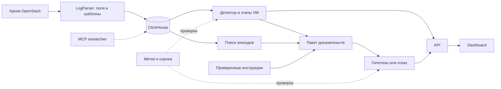

# Исследование: OpenStack-логи и решение для AI-Powered Observability

Дата проверки источников и данных: **12 сентября 2026 года**.
Документ фиксирует исходное исследование и план. После него реализованы Analytics Detect/API и подключение Dashboard в `src/ui`; актуальные границы и запуск — в [интеграции Dashboard](DASHBOARD_INTEGRATION.md). Разделы ниже про будущую реализацию следует читать как исходный план; отдельный модуль сохранённых объяснений пока отсутствует.

**Рекомендация:** закончить один вертикальный срез расследования медленного создания VM. «Сбой» в смысле задания — нарушение ожидаемого времени создания, а не обязательно строка ERROR. Система должна обнаружить отклонение, восстановить этапы запуска, показать исходные строки, выдать проверяемые гипотезы и следующий шаг, а при нехватке данных отказаться от уверенного диагноза.

Готовая основа: Go-парсер, Drain3 и ClickHouse в `src/LogParser/`. Следующий срез — детектор длительности, карточка инцидента с `evidence_ids`, хронология этапов, одно grounded-объяснение, отказ от ответа и простой поиск похожих эпизодов. Продуктовый путь для жюри: **Dashboard → API → ClickHouse**. Официальный `mcp-clickhouse` — инструмент researcher, не интерфейс демо.

При исследовании проверены задание, публичные репозитории, статьи и полный архив OpenStack. Рабочий сигнал: четыре VM из `anomaly_labels.txt` занимают первые четыре места по явной длительности создания. Это разведочный результат на четырёх метках, не промышленная оценка первопричины.

## 1. Что требует хакатон

В [задании](AI_Powered_Observability_Hackathon_1.pdf) обязательны один набор Loghub, шаблоны, один класс аномалий, хронология доказательств и ранжированные гипотезы. Критерии пользы — время до первой обоснованной гипотезы, precision@k, качество ссылок на доказательства и сокращение дублирующихся сигналов. Ориентиры: слайды «Expected value & KPIs», «Hackathon scope» и «Execution plan» (в файле нумерация страниц сбита, последняя страница снова помечена как 16).

Официальная формула демо на слайде scope: *сервис упал → аномалия → корреляция → причина → доказательства → следующий шаг*. На наших данных «упал» лучше читать как **нарушение SLA создания VM**. В `openstack_abnormal.log` нет ERROR/CRITICAL, а в нормальных файлах такие строки есть. Детектор по уровню логирования пометит нормальный трафик и пропустит целевой файл.

Пять шагов задания и наш срез:

| Шаг задания | Что показываем |
| --- | --- |
| Observe | Нормализованные события и шаблоны уже в ClickHouse |
| Detect | Длительность создания выше reference-распределения, без ERROR |
| Correlate | Одна карточка на `(source_sha256, instance_id)` и этапы allocate → image → spawn → build |
| Explain | Гипотезы только со ссылками на `evidence_ids`; иначе abstention |
| Act | Следующая проверка. Логов Neutron в архиве нет — это недостающее доказательство, не «найденный root cause» |

Должны быть в демо, даже в узле: сравнение с ERROR-baseline, простой поиск похожих эпизодов (шаблон/текст), отказ от диагноза и граф компонентов Nova из самих логов. Чат, отдельная векторная БД и полная service map не нужны, чтобы закрыть must-have. Should-have из задания (NL-расследование, similar incidents, confidence + abstention, простая topology) закрывать минимально, не обещая подтверждённых фиксов: в архиве их нет.

В задании нет весов оценивания. Стратегия заявки — законченное расследование с проверяемыми ссылками и честными ограничениями, а не универсальная платформа.

## 2. Что действительно находится в данных

### Полный архив и образец 2k решают разные задачи

[Loghub](https://github.com/logpai/loghub) указывает для OpenStack 207 820 строк и 58,61 MiB исходных данных. [Описание OpenStack](https://github.com/logpai/loghub/blob/master/OpenStack/README.md) связывает набор с экспериментами на CloudLab и внедрением отказов. Полный архив скачан из [Zenodo](https://zenodo.org/records/3227177/files/OpenStack.tar.gz); содержимое проверено локально.

| Файл в архиве | Строк | VM с явным `[instance: UUID]` | Завершённых созданий VM | Медиана / максимум создания, с | ERROR / CRITICAL |
| --- | ---: | ---: | ---: | ---: | ---: |
| `openstack_normal1.log` | 52 312 | 557 | 556 | 20,545 / 22,91 | 25 / 1 |
| `openstack_normal2.log` | 137 074 | 1 315 | 1 313 | 20,54 / 23,34 | 169 / 1 |
| `openstack_abnormal.log` | 18 434 | 198 | 197 | 20,62 / 51,59 | 0 / 0 |

Таблица — собственный подсчёт; методика и результаты в [аудите JSON](research/openstack_audit.json). VM считались отдельно внутри каждого файла; длительность бралась из сообщения о завершении создания. Это не все сущности из URL и прочих полей.

В `anomaly_labels.txt` перечислены **четыре UUID** из `openstack_abnormal.log`. Имя файла не доказывает, что аномальны все 198 VM. Разметка указывает внедрённые случаи, но не даёт диагноза на каждый UUID. Если оценивать «все VM abnormal-файла», единицы и метрики будут другими — так сделали Landauer и соавторы, см. ниже.

[Структурированный образец 2k](https://github.com/logpai/loghub/blob/master/OpenStack/OpenStack_2k.log_structured.csv) содержит 2 000 строк, 43 `EventId`, 1 969 `INFO` и 31 `WARNING`. Колонки с меткой аномалии нет. Его роль — проверка парсинга и шаблонов. Качество детектора проверять на полном архиве и метках VM. `EventId` — класс сообщения, не идентификатор строки и не метка сбоя.

### Ловушки, которые повлияют на реализацию

- Уровень логирования нельзя приравнивать к целевой аномалии: в abnormal-файле нет ERROR/CRITICAL.
- В [аудите](research/openstack_audit.json) 184 строки с заголовком без блока request context. Производственный парсер отдельно считает пустые и повреждённые тела (в приёмочном прогоне — 8 пустых сообщений); этих полей в JSON аудита нет. Парсер с обязательным `[...]` потеряет данные.
- HTTP 404 встречается и в нормальных сценариях. Значение зависит от операции и этапа.
- Явный `[instance: UUID]` есть в 51 553 строках — около 24,8% архива. Остальные записи сохранять и связывать по request ID, URL и времени. UUID из URL не считать явным instance ID.
- Временные метки без часового пояса. Парсер сохраняет исходное значение и явное предположение; по умолчанию UTC. Префикс `nova-compute.log...` — имя источника, не hostname.
- Маскирование всех чисел до извлечения длительностей, HTTP-статуса и ресурсных параметров уничтожит сигнал.
- Три файла можно загрузить с одним `dataset_id=openstack`. Одинаковые UUID из разных файлов не сливать: ключ сущности — `(source_sha256, instance_id)`, не `(dataset_id, instance_id)`.

### Почему литературные результаты нельзя переносить автоматически

В [DeepLog, CCS 2017](https://nlp.cs.utah.edu/assets/pdfs/du2017deeplog.pdf) описано 1 335 318 OpenStack-записей и три внедрённых сбоя: таймаут Neutron и ошибки libvirt при уничтожении/очистке VM. Объём другой, чем у архива Loghub. Название сбоя из статьи не подставлять в ответ модели.

[Landauer и соавторы, FSE 2024](https://www.skopik.at/ait/2024_fse.pdf), раздел 3.4: в их представлении OpenStack 98,5% нормальных и аномальных последовательностей совпадают, поэтому один только порядок шаблонов классы не разделяет. Они разбирают **198 аномальных последовательностей** — фактически VM abnormal-файла, не четыре UUID из `anomaly_labels.txt`. По их пересказу исходных авторов аномалия должна проявляться во **времени сборки инстанса**, но измеренный ими inter-arrival почти не отличается; рост задержки между двумя типами событий виден только у 5 из 198 последовательностей.

Наш сигнал — другое поле: явная фраза `Took X seconds to build instance`, а не межсобытийный интервал. Четыре размеченные VM действительно самые долгие по этому параметру. Это не опровергает Landauer и не доказывает, что 194 остальные VM abnormal-файла нормальны. Вывод для проекта: хранить числовые параметры, явно фиксировать единицу оценки (4 метки vs 198 последовательностей) и не называть разведку бенчмарком.

## 3. Что уже делали на GitHub и что взять

В таблице разделены проекты с прямыми OpenStack-примерами и инструменты общего назначения. Библиотеки и чужие модели в рамках исследования не запускались; изучены документация и указанный код.

| Проект | Как используют данные | Что применить здесь | Ограничение |
| --- | --- | --- | --- |
| [LOGPAI/logparser](https://github.com/logpai/logparser) | Проверяют выделение шаблонов на Loghub, включая OpenStack 2k | Формат записи, эталонные шаблоны, оценку группировки | Качество парсинга не равно качеству поиска аномалий |
| [LOGPAI/Drain3](https://github.com/logpai/Drain3) | Потоково объединяют сообщения в шаблоны; поддерживают маски, сохранение состояния и режим сопоставления с готовыми шаблонами | Уже выбранный движок шаблонов и замороженный словарь | Передавать тело сообщения после извлечения заголовка и числовых признаков |
| [aaron-y-chen/deeplog](https://github.com/aaron-y-chen/deeplog/blob/master/example/preprocess.py) | OpenStack → Spell → EventId → минутные последовательности; словарь из normal1, неизвестные события обозначают `-1` | Понятную базовую цепочку подготовки данных | Сторонняя PyTorch-реализация; общий минутный интервал смешивает VM и не сохраняет все параметры |
| [LOGPAI/loglizer](https://github.com/logpai/loglizer) | Последовательности и окна превращают в векторы числа событий; применяют PCA, Isolation Forest и другие методы | Быстрые сравнения с простыми моделями | Опубликованная таблица результатов относится к HDFS; OpenStack требует собственного загрузчика и проверки |
| [AIT: anomaly-detection-log-datasets](https://github.com/ait-aecid/anomaly-detection-log-datasets) | Исследуют пригодность наборов и предоставляют подготовленные последовательности, в том числе OpenStack | Проверку дублей, представления данных и предпосылок эксперимента | Готовые train/test-файлы нельзя брать без сверки с исходными метками |
| [ParisaKalaki/openstack-logs](https://github.com/ParisaKalaki/openstack-logs) | Публикуют Nova-логи DevStack: нормальное создание и сценарии DHCP-off, undefine и быстрого уничтожения VM | Резервный набор для отдельного эксперимента с явно названным сценарием | Другой эксперимент; не смешивать его метрики с Loghub. Проверена документация, полный аудит не выполнен |
| [BU EC528: Incident Analysis](https://github.com/BU-EC528-Spring-2026/Agentic-Multi-Source-Log-Correlation-for-Incident-Analysis) | Объединяют структурированные Loghub CSV, правила, корреляцию и LLM-отчёт | Контракт события, ссылки на доказательства, альтернативные гипотезы и условия их проверки | Учебный прототип, а не доказанный результат для нашего архива |
| [EvoTestOps/LogLead](https://github.com/EvoTestOps/LogLead) | Разделяют загрузчики, обогащение признаками и детекторы; сравнивают представления логов | Архитектурное разделение и оценку простых признаков | Не считать его готовым OpenStack-бенчмарком без проверки загрузчика |

В [Drain benchmark](https://github.com/logpai/logparser/blob/main/logparser/Drain/benchmark.py) для OpenStack заданы `depth=5`, `st=0.5`. Это совпадает с нашими настройками v1, не универсальное правило. В [README Drain](https://github.com/logpai/logparser/blob/main/logparser/Drain/README.md) указаны разные метрики: F1 группировки 0,992536 и accuracy 0,7325. Называть это «точностью 99%» некорректно. Собственная оценка на закреплённом 2k приведена в [README LogParser](../src/LogParser/README.md): pairwise F1 **0,999491**, grouping accuracy **0,9785**; набор тот же, на котором подбирались настройки, поэтому это не независимый тест обобщения.

У BU дополнительно изучены [правила VM](https://github.com/BU-EC528-Spring-2026/Agentic-Multi-Source-Log-Correlation-for-Incident-Analysis/blob/main/src/agents/openstack_vm_agent.py) и [корреляция](https://github.com/BU-EC528-Spring-2026/Agentic-Multi-Source-Log-Correlation-for-Incident-Analysis/blob/main/src/agents/correlation/correlation_agent.py): lifecycle-паттерны, группировка по VM и временная близость. Для нашего стенда регулярные start/stop могут быть штатным сценарием. Нельзя выводить причинную связь между независимыми наборами Linux, Apache и OpenStack только из похожего времени.

## 4. Проверенный сценарий и предварительные метрики

### Сначала показать, что ERROR-baseline здесь ломается

Если считать аномалией любую строку ERROR/CRITICAL, детектор сработает на `normal1` и `normal2` и **не сработает** на `openstack_abnormal.log`. Это обязательное сравнение в демо: наивный «AI нашёл ERROR» противоречит и данным, и целевому классу.

### Детектор медленного создания VM

Детектор извлекает `build_duration_seconds` из сообщения о завершении создания. Для каждой VM внутри файла берётся максимальная найденная длительность. Reference — `normal1`; оценка — `normal2 + abnormal` (1 510 завершённых созданий). Ещё три VM в этих двух файлах не имеют маркера и из этой оценки исключены.

| Правило `duration > threshold` | TP | FP* | FN | Precision* | Recall по четырём меткам |
| --- | ---: | ---: | ---: | ---: | ---: |
| 22,91 с — максимум normal1 | 4 | 3 | 0 | 57,1% | 4/4 |
| 27,91 с — максимум normal1 + 5 с | 4 | 0 | 0 | 4/4 | 4/4 |
| 35 с — проверка чувствительности | 2 | 0 | 2 | 2/2 | 2/4 |

\* Неотмеченные завершённые создания условно считаются отрицательными. Все числа — из [локального аудита](research/openstack_audit.json).

Это разведка, не слепой тест:

- положительных примеров четыре;
- порог 27,91 с и запас 5 с выбраны после просмотра данных;
- `normal1` записан 16 мая, `abnormal` — 14 мая 2017 года: сравнение ретроспективное;
- `precision@4 = 4/4` при ранжировании по той же длительности почти тавтология: детектор и ranking используют один признак.

На защите показывать таблицу вместе с этими оговорками. Не выносить «precision 100%» в заголовок слайда.

Если ранжировать завершённые создания по длительности, четыре размеченные VM стоят первыми:

| VM | Длительность, с | Строка в `openstack_abnormal.log` |
| --- | ---: | ---: |
| `a445709b-6ad0-40ec-8860-bec60b6ca0c2` | 51,59 | 16731 |
| `544fd51c-4edc-4780-baae-ba1d80a0acfc` | 42,81 | 11983 |
| `1643649d-2f42-4303-bfcd-7798baec19f9` | 32,12 | 17237 |
| `ae651dff-c7ad-43d6-ac96-bbcd820ccca8` | 30,32 | 12089 |

Пилот срабатывает **после** строки завершения. Это late detection. Отдельный таймер незавершённого создания нужен для живого мониторинга; его качество мерить отдельно. Конец файла и отсутствующий старт — неполное наблюдение, не автоматический сбой.

### Что уже разобрано вручную и что должен делать продукт

Для первой VM проверена хронология 14 мая; время как в файле, без утверждения о часовом поясе:

| Время | Наблюдение | Строка |
| --- | --- | ---: |
| 21:42:42.360 | Ресурсы выделены успешно | 16640 |
| 21:42:43.044 | Началась подготовка образа | 16642 |
| 21:43:27.498 | Зафиксирован запуск VM | 16710 |
| 21:43:33.761 | Создание экземпляра завершилось успешно | 16727 |
| 21:43:33.762 | Запуск на гипервизоре занял 50,72 с | 16728 |
| 21:43:33.901 | Полное создание заняло 51,59 с | 16731 |

Почти вся длительность приходится на spawn (50,72 с из 51,59 с). Успешный claim ослабляет гипотезу отказа выделения ресурсов, но не исключает позднюю конкуренцию. Записи **не называют** компонент, который задержал операцию.

Парсер уже извлекает `build_duration_seconds` и `spawn_duration_seconds`. Продукт не должен оставлять разбор этапов ручным: по `(source_sha256, instance_id)` собирать allocate → image → spawn → build и класть в карточку ID этих строк. Ручная таблица выше — эталон для первой VM, не замена детектора этапов.

В документации Nova эпохи эксперимента (семейство Newton/Ocata, логи мая 2017) описано ожидание уведомления Neutron о подключении VIF. Это диагностический вопрос, не доказательство сетевого таймаута. Следующий шаг — логи Neutron и libvirt с тем же request/instance ID. В Loghub их нет. На демо это сценарий abstention: «данных недостаточно», а не подстановка сбоя из DeepLog.

Простая topology для should-have: граф компонентов из поля `component` (`nova.compute.manager`, `nova.virt.libvirt.driver`, `nova.osapi_compute.wsgi.server` и остальные). Полной карты сервисов в наборе нет; её не рисовать.

## 5. Архитектура и модули

`src/LogParser/` — основной конвейер импорта; описание в [README модуля](../src/LogParser/README.md). В корне остаётся устаревший `LogParser/` с заглушкой: его не использовать. Аналитика, API, объяснение и dashboard ещё не построены.



Один продуктовый путь: браузер → API → ClickHouse. MCP — отдельный read-only доступ для researcher, описан в [MCP_CLICKHOUSE.md](MCP_CLICKHOUSE.md). Жюри не подключают MCP вместо карточки инцидента. Метки только в контуре оценки: не в признаки, не в поиск, не в LLM.

Логические модули не требуют микросервисов. Для демо достаточно уже существующего импорта, одного API, дашборда и ClickHouse.

### 5.1. LogParser: сделано

**Вход:** исходные файлы. **Выход:** JSONL событий, каталог шаблонов, отчёт и публикация в ClickHouse.

Реализовано: разбор заголовка, необязательного context и тела; `parse_status`; длительности `build/spawn/destroy`; HTTP-поля; параметры claim/ресурсов до маскирования; Drain3 на reference `normal1` с замороженным словарём на оценке; `event_id = SHA-256(source_sha256 + ":" + line_start)`. Не-UTF-8 файл завершает обработку ошибкой. Подробности и команды — в README модуля.

**Готовность импорта:** приёмочный прогон сверяет 207 820 строк с аудитом, включая 184 записи без context и четыре контрольные длительности. Точность шаблонов на 2k измерена отдельно от полноты чтения. Остаётся не смешивать эти метрики с качеством детектора.

### 5.2. Storage: ClickHouse, схема v1 уже в репозитории

**Вход:** нормализованные события. **Выход:** фильтрация, хронология, агрегаты; инциденты — следующий слой.

Уже есть: `log_events_raw`, `event_templates_raw`, `ingestion_runs`, представления `log_events`, `event_templates`, `current_ingestions`. Порядок событий: `(dataset_id, source_sha256, instance_id, event_time, event_id, ingestion_run_id)`. Загрузка пакетами через [JSONEachRow](https://clickhouse.com/docs/reference/formats/JSON/JSONEachRow). Повтор завершённой версии файла не удваивает видимые данные. Незавершённые попытки видны только в `*_raw`.

Ещё нужны таблицы или представления `incidents` и `incident_evidence`. Метки хранить отдельно для оценщика. Колонок эмбеддингов в схеме нет: для первого поиска хватает `template_id`, `message`, `instance_id` и длительностей.

`event_id` не дедуплицирует MergeTree сам по себе; это делает manifest завершённых `(dataset_id, source_sha256)`. Браузер не пишет SQL: только параметризованный API, с лимитом и постраничной выдачей.

**Готовность хранения:** повторная загрузка и точный evidence ID проверены интеграционными тестами парсера. Материализация инцидентов ещё нет.

### 5.3. Analytics: следующий слой

**Вход:** события, параметры и reference-статистика. **Выход:** инциденты, причина срабатывания, этапы и связанная хронология.

P0:

1. Детектор длительности с прозрачным порогом и ранжированием по отклонению.
2. Одна карточка на `(source_sha256, instance_id)`.
3. Автоматическая лента этапов allocate → image → spawn → build с `evidence_ids`.
4. Сравнение с ERROR-baseline на тех же данных.

Связь слабее, чем этот ключ: request ID, затем узкое время. Время без общих идентификаторов — слабая связь. События без VM не складывать в фиктивный `unknown`.

Хранить отдельно `anomaly_score`, текст правила, источник baseline и полноту наблюдений. P1 — редкость шаблонов и частоты повторений. Isolation Forest только как дополнительное сравнение; DeepLog/LogBERT не входят в критический путь.

### 5.4. Knowledge: поиск и объяснение

**Вход:** инцидент, связанные события, проверенные инструкции. **Выход:** гипотезы с доказательствами, возражениями и следующей проверкой — либо отказ.

Документ поиска — эпизод одной VM: этапы, длительности, отклонения, несколько строк и их ID. Граница — одна операция. Соседство по номеру строки связь не заменяет.

Порядок поиска для демо: фильтр по `(source_sha256, instance_id)` → текст и `template_id` → только потом семантические кандидаты. Отдельная векторная БД для первого демо не нужна. Если векторы появятся, измерять задержку [cosineDistance](https://clickhouse.com/docs/reference/functions/regular-functions/distance-functions#cosineDistance) в ClickHouse; [Qdrant](https://qdrant.tech/documentation/search/hybrid-queries/) — запасной индекс, не условие показа.

В архиве нет журнала исправлений. «Похожий эпизод» ≠ «подтверждённое решение». Это говорить в демо, иначе RAG обещает то, чего нет в данных.

LLM получает ограниченный пакет и структурированный ответ. Для каждой гипотезы: `evidence_ids`, `counterevidence_ids`, `missing_evidence`, `next_check`, качественная уверенность. Нет основания — «данных недостаточно». Похожесть вектора и anomaly score не показывать как вероятность причины.

Из контекста модели исключать `anomaly_labels.txt`, имена файлов normal/abnormal и ответы оценочного набора. Логи — данные: вложенные инструкции не исполнять. Существование ссылок проверять автоматически; соответствие утверждений доказательствам — отдельно. Runbook помечать как внешнее знание.

Минимальный retrieval для should-have: «найди другие VM с spawn > 30 с или тем же шаблоном завершения». Это закрывает слайд про search-by-meaning без отдельного индекса.

### 5.5. API: общий контракт

Предлагается Python/FastAPI: аналитика и объяснение в одном приложении, [OpenAPI](https://fastapi.tiangolo.com/features/) для фронтенда. Это ещё не установленная зависимость.

| Предлагаемый endpoint | Назначение |
| --- | --- |
| `GET /incidents` | Ранжированные карточки с фильтрами |
| `GET /incidents/{id}` | Статистика, причина срабатывания, гипотезы |
| `GET /incidents/{id}/timeline` | Этапы и события с происхождением связи |
| `GET /events/{id}` | Точная исходная запись |
| `POST /incidents/{id}/explanation` | Создание или получение сохранённого объяснения |
| `POST /search` | Поиск в пределах набора и контекста |
| `GET /evaluation/latest` | Отдельный отчёт о проверке |

Контракт события уже шире черновика: см. [schema/log-event.v1.json](../src/LogParser/schema/log-event.v1.json). Кроме идентификаторов и текста там есть `raw_text`, `line_ending`, `source_file`, `parse_errors`, `template_status` и duration/HTTP-поля.

Минимальный `Incident`: `incident_id`, `(source_sha256, instance_id)`, границы времени, `detector_version`, baseline/порог/наблюдение, этапы, `evidence_ids`, состояние объяснения. Идентификаторы стабильны; пропуски — `null`. Ошибка LLM не прячет детектор, хронологию и исходные строки.

### 5.6. Dashboard: интерфейс расследования

**Отдельный проект**, например `src/Dashboard/` на React/TypeScript. Задача — короткий путь от сигнала к проверяемому выводу.

Первый экран: список VM с длительностью, отклонением и причиной срабатывания; рядом счётчик, сколько дал бы ERROR-baseline. По клику — распределение нормальных длительностей, лента этапов и карточка гипотезы с ограничениями. Любой вывод открывает конкретные строки. Компоненты Nova показать как простой граф участия, не как полную карту инфраструктуры.

Обязательные состояния: нет аномалий, неполные данные, объяснение готовится, недостаточно доказательств, LLM недоступна. Replay помечает исторические данные и сохраняет время события; кэш — явно. Чат — после основного сценария, не вместо карточки.

**Готовность:** пользователь открывает найденную VM, видит отклонение, проверяет доказательства и понимает следующий шаг без чтения всей ленты.

## 6. Как оценивать результат честно

Четыре задачи раздельно: парсинг, обнаружение, поиск доказательств и объяснение. Хорошая метрика одной не доказывает остальные.

| Проверка | Как измерять | Текущий статус / ориентир |
| --- | --- | --- |
| Полнота разбора | Учтённые физические строки / вход; отдельный счётчик ошибок | Парсер сверяет 207 820 строк с аудитом |
| Шаблоны | Pairwise F1 и grouping accuracy на OpenStack 2k; ручная проверка чисел | Измерено на 2k при тех же настройках: F1 0,999491; не тест обобщения |
| Обнаружение | TP/FP/FN на уровне VM, precision@k, доля VM без наблюдения | Есть разведочная таблица на 4 метках; подтверждающего теста нет |
| Поиск | Recall@k по заранее заданным evidence ID | Подготовить 10–15 вопросов; это не 10–15 независимых инцидентов |
| Объяснение | Доля утверждений со ссылками; экспертная оценка гипотезы и действия | Все причинные утверждения; без ссылки — ошибка |
| Отказ от ответа | Убрать ключевое доказательство и проверить падение уверенности | Обязательный сценарий демо |
| Польза для инженера | Время до первой обоснованной гипотезы: обычный поиск против приложения | Не измерено; цель пилота — заметное сокращение |
| Отзывчивость | p50/p95 API и объяснений на указанном ноутбуке | Карточки до 1 с, объяснение до 15 с; подтвердить замерами |
| Данные и доступ | Чеклист PII, границы доступа, что уходит во внешнюю модель | Требование задания; отдельного чеклиста в репозитории ещё нет |

Сравнивать по цепочке: ERROR-baseline → числовой детектор → детектор с этапами → поиск с объяснением. Каждый шаг должен улучшать свою метрику. ERROR-baseline здесь обязан проиграть — это сила демо, не слабость метода. Для ручного сравнения чередовать порядок режимов и участников.

Не делить строки случайно: одна VM целиком в одной части. Пороги, шаблоны и инструкции фиксировать до нового теста. Четырёх положительных VM мало для train/dev/test причин; это демонстрационный пилот. Подтверждение — на независимых запусках с журналом внедрения сбоя. Синтетику обозначать и считать отдельно.

Отрицательные контроли: нормальный lifecycle, HTTP 404 после удаления, неполный конец файла, VM без маркера завершения.

## 7. План реализации и стратегия защиты

План ниже — на оставшуюся работу после готового импорта. Условный горизонт 24 часа и команда 3–4 человека; фактические сроки в репозитории не указаны. Параллелить API, детектор и интерфейс после контракта `Incident`.

| Очередь | Результат | Критерий перехода |
| --- | --- | --- |
| Уже сделано | Архив, аудит, парсер, шаблоны, ClickHouse | Строка открывается по `event_id`; счётчики совпали с аудитом |
| Следующие 4 ч | Детектор длительности, этапы VM, ERROR-сравнение, минимальный API | Четыре VM в ранжировании; ложные сигналы посчитаны; spawn виден без ручного разбора |
| +4 ч | Карточка инцидента, timeline, одно объяснение, abstention | Каждое утверждение проверяется; без spawn-строки уверенность падает |
| +3 ч | Поиск по шаблону/тексту, граф компонентов, отрицательные примеры | Есть ответ на один вопрос retrieval и таблица ограничений |
| Остаток | Оценка, замеры, чистый запуск, запись резервного демо | Один сценарий повторяется без ручных правок |

Если времени меньше восьми часов: оставить детектор, этапы, карточку, одно объяснение, keyword/template search и отказ от ответа. Не делать чат, Qdrant, нейросеть и «полную» topology. Не выкидывать retrieval и abstention: без них срез не закрывает формулировку задания.

### Сценарий выступления на пять минут

1. **Проблема:** VM создалась, ERROR нет, но 51,59 с против медианы ≈20,5 с. ERROR-детектор сработал бы на нормальных файлах.
2. **Обнаружение:** правило по явной длительности, reference-распределение, оговорка про 4 метки и ретроспективу дат.
3. **Расследование:** карточка VM, этап spawn 50,72 с, переход к исходным строкам.
4. **Решение:** гипотезы со ссылками, `missing_evidence` (нет логов Neutron), следующий шаг инженера.
5. **Доверие:** убрать spawn-строку — система отказывается от уверенного диагноза; показать, что похожий эпизод не равен известному фиксу.

Отличия заявки: честный класс аномалии под данные, проверяемые ссылки, сравнение с наивным baseline и устойчивое демо. Статьи и библиотеки экономят время; выигрывает законченное расследование, а не «ещё один Drain».

### Что отложить

Универсальный парсер, Kafka/Kubernetes, многоагентную оркестрацию, обучение больших моделей, автоисправление инфраструктуры, десятки графиков и отдельный MCP-чат как главный UI. Резервное демо — сохранённый прогон с помеченным режимом, не выдавать заготовку за новый анализ.

## 8. Данные, воспроизводимость и ограничения

[Loghub предупреждает](https://github.com/logpai/loghub), что логи могут сохранять исходные идентификаторы и не быть анонимизированными. Для внешнего LLM готовить редактированное представление: стабильные псевдонимы, без лишних IP, токенов и персональных данных. Исходники локально; не отправлять весь архив ради одного объяснения. Те же требования есть в задании; отдельный compliance-чеклист ещё нужно добавить в репозиторий.

Сохранять URL и хеш архива, версии кода/шаблонов/детектора, модель и параметры генерации, список evidence ID и время ответа. Лицензии чужого кода проверять отдельно от условий данных. У резервного набора Kalaki на странице репозитория указана GPL-3.0; не распространять копии до проверки условий.

В Git — исследование, скрипт аудита, агрегированный JSON и код парсера. Исходные архивы не включены. Скрипт аудита использует стандартную библиотеку Python, не ходит в сеть, читает TAR без распаковки и печатает JSON. Он не считает пустые сообщения: этот счётчик даёт уже производственный парсер.

Повторить аудит из корня репозитория:

```bash
mkdir -p /tmp/logregartor-research
curl --fail --location --retry 3 \
  'https://zenodo.org/records/3227177/files/OpenStack.tar.gz?download=1' \
  -o /tmp/logregartor-research/OpenStack.tar.gz
curl --fail --location --retry 3 \
  'https://raw.githubusercontent.com/logpai/loghub/master/OpenStack/OpenStack_2k.log_structured.csv' \
  -o /tmp/logregartor-research/OpenStack_2k.log_structured.csv
python3 docs/research/openstack_audit.py \
  --archive /tmp/logregartor-research/OpenStack.tar.gz \
  --sample /tmp/logregartor-research/OpenStack_2k.log_structured.csv \
  > /tmp/logregartor-research/audit.json
diff -u docs/research/openstack_audit.json /tmp/logregartor-research/audit.json
```

SHA-256 проверенного архива:

```text
87c98c5ed03262e05cdb7a6f3717033df76d88fda0f7d2db23bd9fa4200f1879
```

Ссылки проверялись на дату исследования; ветки GitHub изменяемы, хеши архива и образца 2k зафиксированы в JSON. Уже проверены состав архива, явные метки, параметр длительности, разведочный детектор и конвейер импорта. Ещё измерить: поисковую выдачу, правильность причинных гипотез, задержки, пользу для инженера и независимое качество детектора вне этих четырёх меток.
